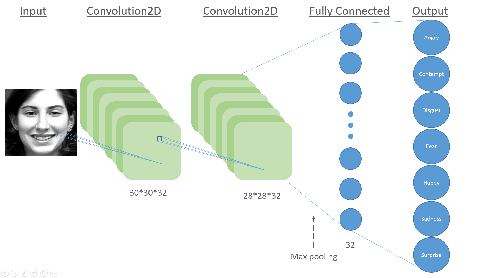

# Deep Project

In this Deep Learning project, we worked on face expression recognition. 
It is based on a CNN algorithm which is trained and tested on the database CK+ using a simple Architecture. We obtained a validation accuracy of 86% (more or less 2%).


## Usage and dependencies 

### Usage : 

Datasets are saved for 3 different sizes for a k fold = 5:

- Image dimension : (32, 32) Usable with 'ck5fold.npy'
- Image dimension : (64, 64) Usable with 'ck5fold64.npy'
- Image dimension : (96, 96) Usable with 'ck5fold96x96.npy'

A DataSet is also usable for a k-fold = 10:

- Image dimension : (32,32) Usable with 'ck10fold.npy'

If you want to recreate your own DataSet, first you will have to download Ck+ database.
Then, change the path directory in "LoadCK.py". 
And finally, uncomment in CNN.py the part "Read and save dataset" and put as comment "Load dataset".

### Dependencies :

The code run under Python 3.5.
You will need numpy, keras 2.0.9, opencv(-python) (as cv2), itertools, sklearn and finally os. 


## Function : 

### LoadCK.py

buildDataSetCK(size)

```
Permits to build the dataset from CK+ with the correct path and at the dimension choosen
Build a Matrix of [Sequence (3 Images), Label] Parameter : Size = [row_image,col_image]
```

ShuffleDataSet(mat,k,num_classe)

```
Permits to shuffle the dataset into the different folders, thus we equilibrate the dataset to ensure us to have data on each class for the training as the testing.
The function is also spliting the buildDataSetCK output from [Sequence, Label] to [Img1, Label][Img2, Label][Img3, Label]
All images in a sequence are in the same folder.
```

### Cropping.py

faceCropping(imgpath)

```
Permits to detect faces in the input picture, to crop it and then to resize the picture. 
```

#### ConfusionMatrixBuild.py

plot_confusion_matrix(cm, classes,normalize=False,title='Confusion matrix',cmap=plt.cm.Blues) 

```
Show the confusion matrix using a confusion matrix computed with sklearn.metrics.confusion_matrix(y,y_pred).
```


## Architecture 





## Data Base and treatment

Our CNN is trained and tested on the CK+ database. 

For the training, we keep only the last 3 pictures of each sequence,  they will be the most expressive ones. 
On the other hand, we only test with one picture per sequence.

Once CK+ load, we realise a face detection, we crop it and then we resize the picture to the right dimension (most of the time (32, 32) for us)

When the treatment of the dataset is done, we perform a k-fold method.

### How we perform an efficient splitting for k-fold:

#### 


## Results


Total Test Accuracy
Confusion Matrix
Accuracy
Loss Function


## Authors

* **Alix Hennechart** - *Initial work* -

* **Thomas Gosset** - *Initial work* -


## Contributors

* **Anis Kacem**


