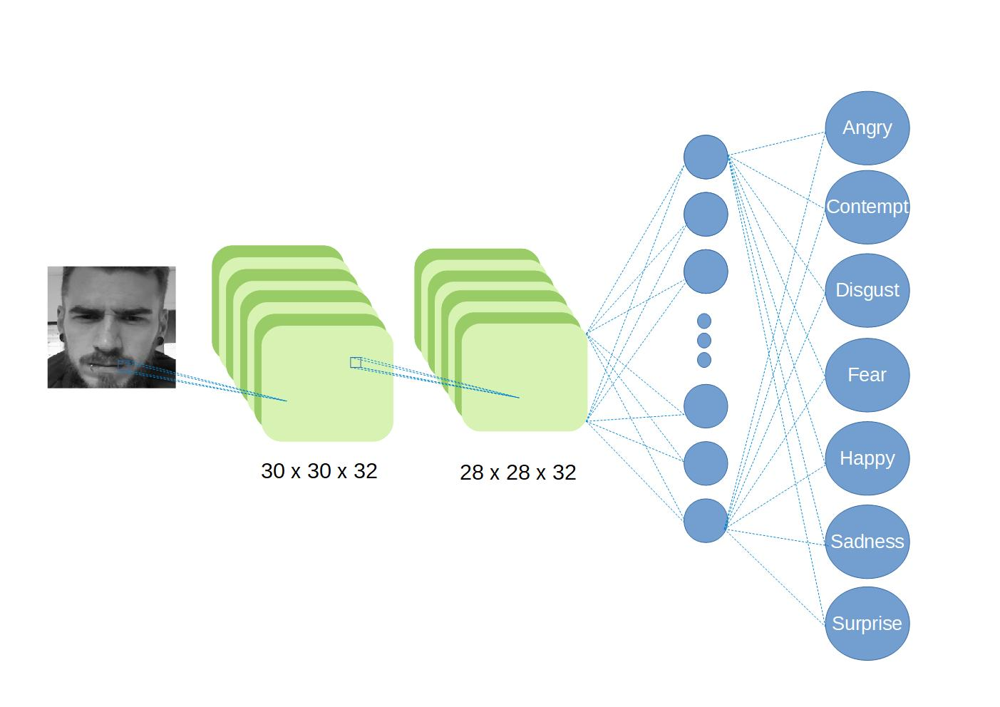
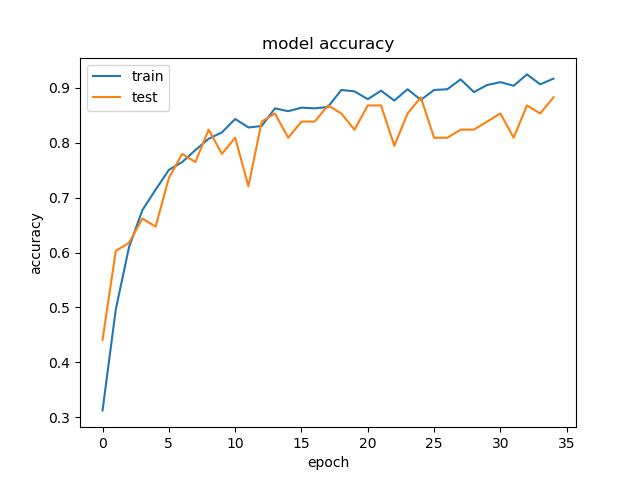
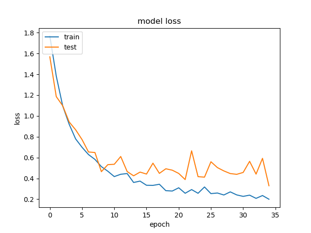
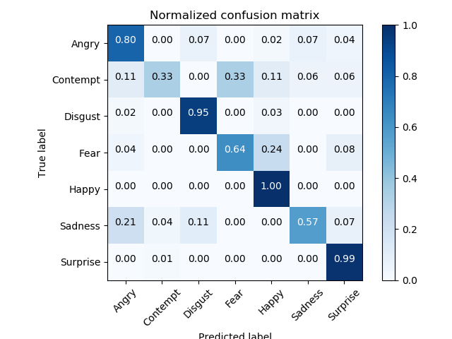
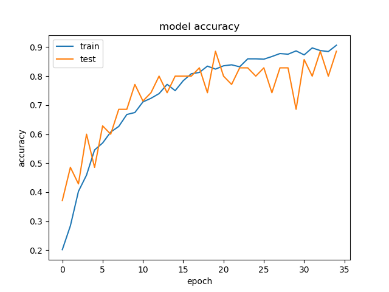
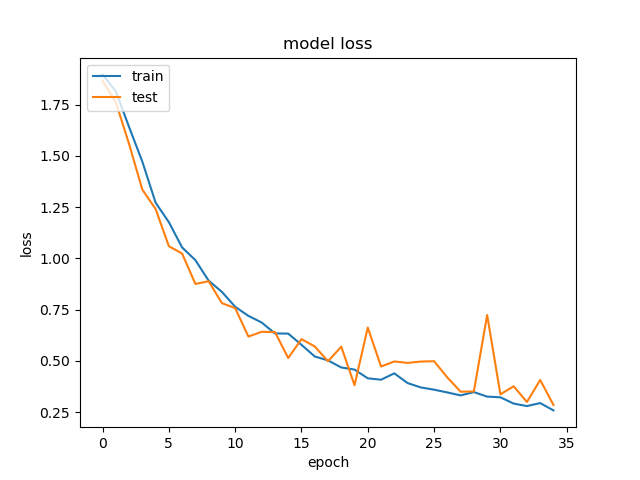

# Deep Project

In this Deep Learning project, we worked on face expression recognition. 
It is based on a CNN algorithm which is trained and tested on the database CK+ using a very simple Architecture. We obtained a validation accuracy of 86% (more or less 2%)(without WeightedCrossentropy).


## Usage and dependencies 

### Usage : 

If you want to recreate your own DataSet, first you will have to download Ck+ database, ask for a user agreement here : http://www.consortium.ri.cmu.edu/ckagree/

Then, change the path directory in "LoadCK.py". 
And finally, uncomment in CNN.py the part "Read and save dataset" and put as comment "Load dataset".

### Dependencies :

The code run under Python 3.5.
You will need numpy, keras 2.0.9, opencv(-python) (as cv2), itertools, sklearn and finally os. 


## Function : 

### LoadCK.py

**buildDataSetCK(size)**

```
Parameter : Size = [row_image,col_image]
Permits to build the dataset from CK+ with the correct path and at the dimension choosen
Build a Matrix of [Sequence (3 Images), Label] 
```

**ShuffleDataSet(mat,k,num_classe)**

```
Parameters : mat = [[[Seq][Label]],...,[Seq][Label]] / k (related to k-fold) / num_classe = number of classes (here 7)
Permits to shuffle the dataset into the different folders, thus we equilibrate the dataset to ensure us to have data on each class for the training as the testing.
The function is also spliting the buildDataSetCK output from [Sequence, Label] to [Img1, Label][Img2, Label][Img3, Label]
All images in a sequence are in the same folder.
```

### Cropping.py

**faceCropping(imgpath)**

```
Parameter :  imgpath = Path of your image
Permits to detect faces in the input picture, to crop it and then to resize the picture.
```

### ConfusionMatrixBuild.py

**plot_confusion_matrix(cm, classes,normalize=False,title='Confusion matrix',cmap=plt.cm.Blues)**

```
Parameters : cm = Confusion Matrix / classes = ['Classe 1', 'Classe2', ...]
Show the confusion matrix using a confusion matrix computed with sklearn.metrics.confusion_matrix(y,y_pred).
```


## Architecture 

Architecture

Run 1 & 2.



Run 3.


## Data Base and treatment

Our CNN is trained and tested on the CK+ database. 

For the training, we keep only the last 3 pictures of each sequence,  they will be the most expressive ones. 
On the other hand, we only test with one picture per sequence.

Once CK+ load, we realise a face detection, we crop it and then we resize the picture to the right dimension (most of the time (32, 32) for us)

When the treatment of the dataset is done, we perform a k-fold method.

### How we perform an efficient splitting for k-fold: (cf ShuffleDataSet(mat,k,num_classe))

#### Step 1

We built 1 Empty Folder per class (let's name them SortedSeq[Label]), we filled each one with the Sequences (Matching the folder's number with the Label), then we shuffle randomly those folders.

#### Step 2

We built k new empty folders,then we equally (actually it is equal modulo(k), the rest is randomly distribuate) filled them with each label using SortedSeq.

## Results

To illustrate our work, we ran with those parameters : 


### Run 1 
- img_rows, img_cols = 32, 32
- batch_size = 32
- epochs = 35
- k = 5
- optimizer = RMSprop
- No weighted crossentropy

**Total Test Accuracy : 0.8657**

#### Confusion Matrix


#### Accuracy



#### Loss Function




### Run 2
- img_rows, img_cols = 32, 32
- batch_size = 32
- epochs = 35
- k = 10
- optimizer = RMSprop
- Architecture Convnet1&2 (64 instead of 32)
- No weighted crossentropy

**Total Test Accuracy : 0.8583**

#### Confusion Matrix



#### Accuracy



#### Loss Function



### Run 3

- img_rows, img_cols = 96,96
- batch_size = 32 
- epochs = 64
- k = 10
- optimizer = RMSprop
- Architecture (cf Architecture)
- Average pooling instead of Max pooling
- Weighted Crossentropy

**Total Test Accuracy : 0.8817**

## Authors

* **Alix Hennechart** - *Main Author* - *Initial work* - 

* **Thomas Gosset** - *Initial work* -


## Contributors

* **Anis Kacem**
* **Mohamed Daoudi**

